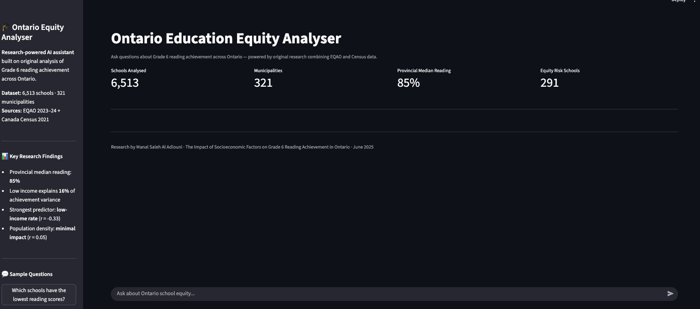
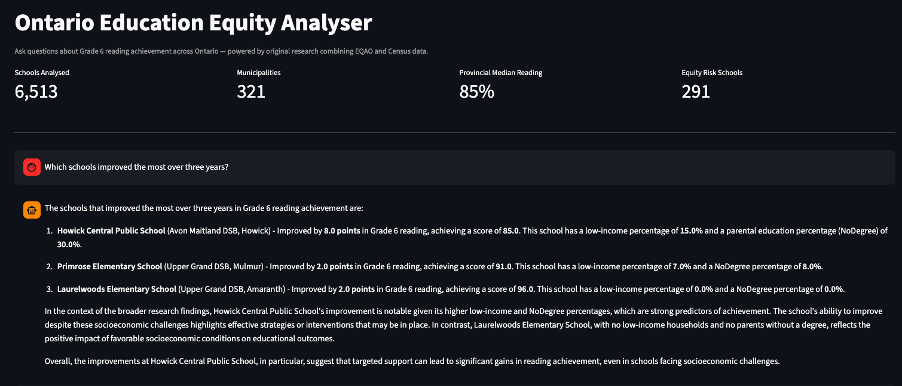
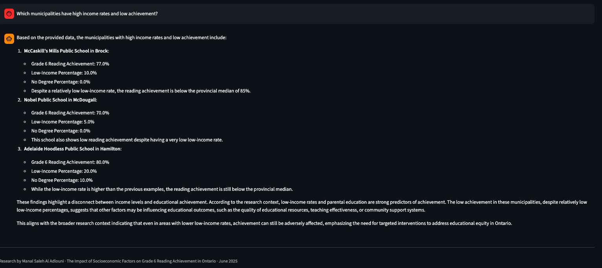

# 🎓 Ontario Education Equity Analyser


An AI-powered tool that lets Ontario school board policy makers query
Grade 6 reading achievement data conversationally — built on original
research covering 6,513 schools across 321 municipalities.

## 🖥️ Demo






---

## 🔍 What It Does

Ask plain-English questions about Ontario school performance and get
data-grounded answers in seconds:

- *"Which schools have the lowest reading scores?"*
- *"Which municipalities have high low-income rates and low achievement?"*
- *"What does the research say about parental education and outcomes?"*
- *"Which boards show the largest reading-math performance gap?"*

---

## 🏗️ Architecture

```
User Question
    ↓
Question Router
  ├── Numeric query → Pandas direct lookup
  │   (lowest scores, highest rates, equity risk schools)
  └── Conceptual query → RAG Pipeline
          ↓
      Chroma Vector Store (4,227 schools embedded)
          ↓
      LangChain + GPT-4o-mini
          ↓
      Grounded Answer → Streamlit Chat UI
```

The hybrid approach uses **pandas for numeric ranking queries**
(where vector similarity search underperforms) and **RAG for
conceptual questions** (where semantic retrieval excels).

---

## 📊 Research Background

Built on original statistical research:
**"The Impact of Socioeconomic Factors on Grade 6 Reading Achievement
in Ontario"** — Manal Saleh Al Adlouni, June 2025

**Dataset:** 2023–24 EQAO school performance + 2021 Canada Census
**Scope:** 6,513 schools · 321 municipalities · OLS regression analysis

**Key findings:**
- Low-income rates: strongest predictor (r = -0.33)
- Parental education: second strongest (r = -0.31)
- Each 10pp increase in low-income ≈ 4.2pt drop in reading scores
- Population density: minimal impact (R² = 0.002)
- Model explains 16% of achievement variance (R² = 0.157)

📄 [Full research repo](https://github.com/msadlouni-lab/ontario-educational-equity-analysis)

---

## ⚙️ Setup

**Prerequisites:** Python 3.9+, OpenAI API key

```bash
# 1. Clone the repo
git clone https://github.com/msadlouni-lab/equity-rag-app
cd equity-rag-app

# 2. Install dependencies
pip install -r requirements.txt

# 3. Add your OpenAI API key
echo "OPENAI_API_KEY=your-key-here" > .env

# 4. Build the vector store (run once, ~2-3 minutes)
python vector_store_research.py

# 5. Launch the app
python -m streamlit run app_research.py
```

App opens at **http://localhost:8501** (local) - live deployment coming soon

---

## 🛠️ Tech Stack

| Component | Technology |
|-----------|-----------|
| LLM | GPT-4o-mini (OpenAI) |
| Embeddings | text-embedding-3-small |
| Vector store | Chroma |
| Orchestration | LangChain |
| UI | Streamlit |
| Data | Pandas + EQAO CSV |
| Language | Python 3.9 |

---

## 📁 Project Structure

```
equity-rag-app/
├── app_research.py          # Streamlit UI + routing logic
├── data_lookup.py           # Pandas direct lookup functions
├── vector_store_research.py # Builds Chroma vector store
├── prepare_research_data.py # Cleans raw research data
├── research_data_clean.csv  # Processed dataset (4,227 schools)
├── requirements.txt
└── screenshots/
    └── app_demo.png
```

---

## 👩‍💻 Author

**Manal Saleh Al Adlouni**
M.S. Data Science & AI — University of London
[GitHub](https://github.com/msadlouni-lab) ·
[Research Repo](https://github.com/msadlouni-lab/ontario-educational-equity-analysis)
